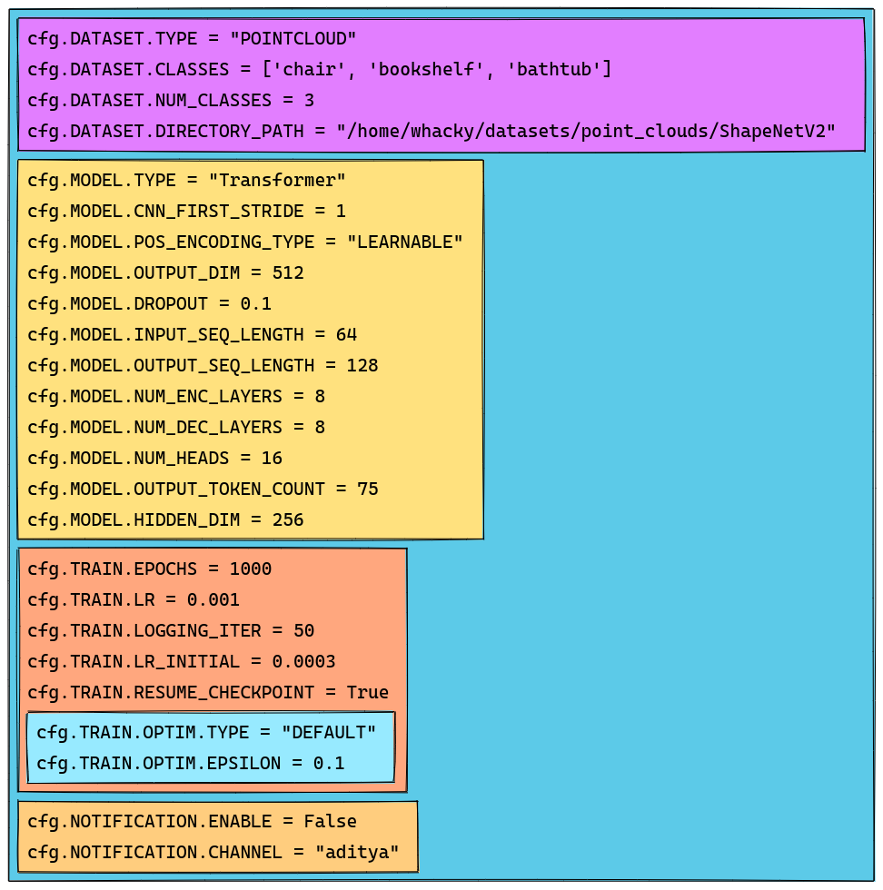
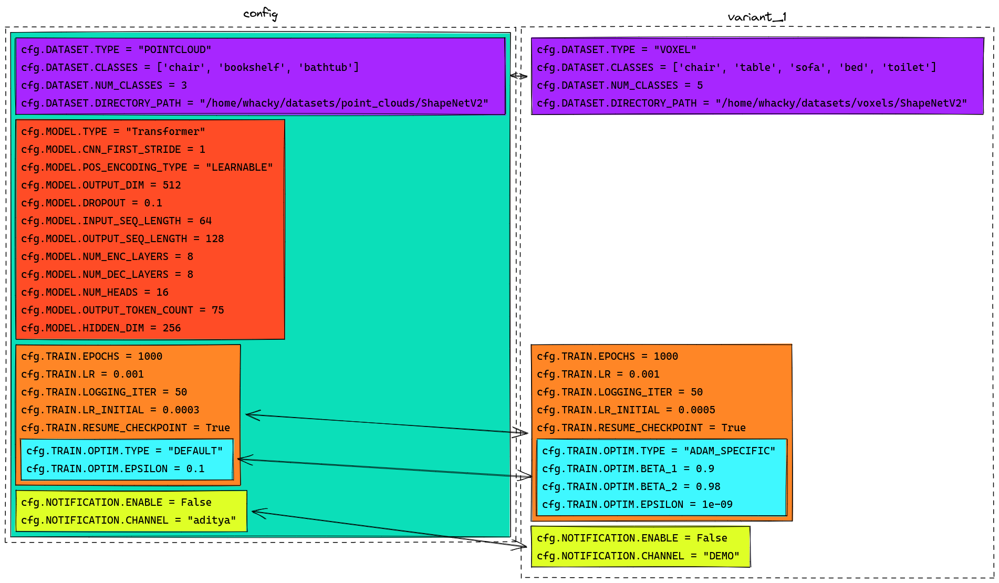

# WACKY: Why Another Ckonfig sYstem

A small extension of YACS with the following features:

### Procedural Configuration

Configure your ablations via `CfgNodeFactory`. `CfgNodeFactory` provides a procedural way to change configuration. Essentially, create a class for the set of configuration variations, and select different versions using `__init__` named parameters. Example given in `configs/ablations/*`.

### Automatic Command-line support

Avoid writing argparser for your configuration. An argparser for `CfgNodeFactory` instantiation parameters is directly created using a class method: `CfgNodeFactory.get_argparser()`. Further, if you want to specifically modify a certain configuration via command-line, simply add them with `--cfg.` prefix. Example shown in `examples/demo.py`.

### Visualization

Visualize your configuration with [procXD](https://github.com/BardOfCodes/procXD). Use `config.to_graph()` to convert the configuration to networkx graphs, and use `procXD`'s `render_stack_sketch` to create an excalidraw file with the configuration as shown below. Visualize excalidraw files either from web (just load the file at [excalidraw.com](https://excalidraw.com/)) or with a vs-code [plugin](https://marketplace.visualstudio.com/items?itemName=pomdtr.excalidraw-editor) (simply open a `.excalidraw` file in vscode - example fines in `example/xd_figures`.

More importantly, verify the changes between ablations via `procXD`'s `render_comparitive_stack_sketch` command.

Find more details in `example/demo.py`.

## Installation

Simpy run `python setup.py install` to install wacky as a package in your python environment.

### Note: Visualization works with [procXD](https://github.com/BardOfCodes/procXD)

## Why?

Do we really need to do this? I think generally in longer research projects configurations eventually do get large and unwieldy. At that point, it helps to do changes programmatically. This fits my usecase, but it may not be right for your usecase!

### Drawbacks with Alternatives

1) [YACS](https://github.com/rbgirshick/yacs): Generally Yacs is great and I have used it in all my previous projects. Howver, its hard to configure ablations procedurally, or have quick command line changes on to config directly with yacs.

2) [Hydra](https://github.com/facebookresearch/hydra): Pretty awesome, espcially since I am stealing the arbitrary config command-line support idea from hydra. Main drawback is that only works with yaml files, which prohibits programmatic configurations.

## Acknowledgements

I used ChatGPT while creating this tool. It was helpful in many ways, especially with boiler-plate code and documentation. But it was misleading at times as well. Overall, it is helpful!
